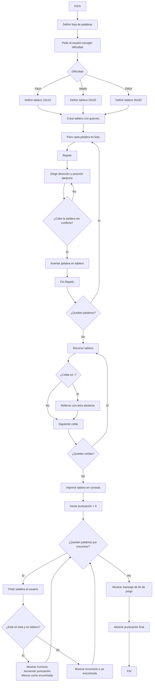

A cristian le gustn los hombres

# Sintax-Slayer-Sopa-de-letras-proyecto-Final

## Objetivo: 📌
Desarrollar una aplicación en Python que genere y permita jugar una sopa de letras de tamaño mínimo 10x10 y máximo 30x30, utilizando palabras clave relacionadas con la carrera de Ingeniería Civil, aplicando los conocimientos adquiridos durante el curso de programación.

## Objetivos especificos 📎
- Implementar estructuras de datos adecuadas (listas, matrices) para representar el tablero de la sopa de letras y gestionar el contenido de forma dinámica.

- Aplicar algoritmos de inserción y búsqueda de palabras en distintas direcciones (horizontal, vertical y diagonal), asegurando que estas no se sobrepongan incorrectamente ni excedan los límites de la matriz.

- Automatizar el proceso de generación del tablero, incluyendo la inserción de letras aleatorias en los espacios vacíos para camuflar las palabras ocultas.

- Diseñar una interfaz simple en consola que permita al usuario interactuar con el juego, ingresar palabras, recibir retroalimentación y visualizar el tablero actualizado.

- Integrar un conjunto de palabras relacionadas con Ingeniería Civil, tales como: cimentación, hormigón, estructura, acero, plano, geotecnia, topografía, entre otras, promoviendo así la familiarización con el vocabulario técnico de la profesión.

- Fomentar la reutilización del código mediante el uso de funciones y/o módulos, favoreciendo el desarrollo estructurado, legible y mantenible.

- Incorporar elementos básicos de validación y control de errores, como verificar la validez de palabras ingresadas o el rango del tablero.

## Diagrama

## Codigo 

