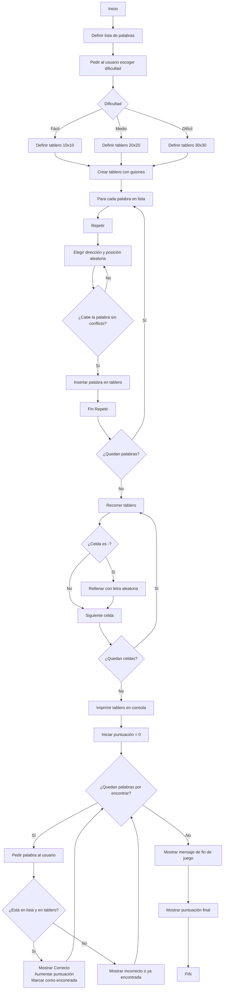

# Sintax-Slayer-Sopa-de-letras ⚔️

### Programacion de computadores

### Universidad Nacional de Colombia

### grupo 7

### Integrantes: 
- Cristian Amezquita
- Sebastian Vega
- Nicolas Valle

## Objetivo: 📌
Desarrollar una aplicación en Python que genere y permita jugar una sopa de letras de tamaño mínimo 10x10 y máximo 30x30, utilizando palabras clave relacionadas con la carrera de Ingeniería Civil, aplicando los conocimientos adquiridos durante el curso de programación.

## Objetivos especificos 📎
- Implementar estructuras de datos adecuadas (listas, matrices) para representar el tablero de la sopa de letras y gestionar el contenido de forma dinámica.

- Aplicar algoritmos de inserción y búsqueda de palabras en distintas direcciones (horizontal, vertical y diagonal), asegurando que estas no se sobrepongan incorrectamente ni excedan los límites de la matriz.

- Automatizar el proceso de generación del tablero, incluyendo la inserción de letras aleatorias en los espacios vacíos para camuflar las palabras ocultas.

- Diseñar una interfaz simple en consola que permita al usuario interactuar con el juego, ingresar palabras, recibir retroalimentación y visualizar el tablero actualizado.

- Integrar un conjunto de palabras relacionadas con Ingeniería Civil, tales como: cimentación, hormigón, estructura, acero, plano, geotecnia, topografía, entre otras, promoviendo así la familiarización con el vocabulario técnico de la profesión.

- Fomentar la reutilización del código mediante el uso de funciones y/o módulos, favoreciendo el desarrollo estructurado, legible y mantenible.

- Incorporar elementos básicos de validación y control de errores, como verificar la validez de palabras ingresadas o el rango del tablero.


## Diagrama


# Explicación Codigo
## 1. Importación de módulos

```python
import random
import pandas as pd
```
- random: permite hacer selecciones aleatorias (por ejemplo, letras o posiciones).
- pandas (pd): se usa para mostrar la sopa de letras como una tabla más ordenada con coordenadas.

## 2. Lista de palabras
```python
palabras_ingenieria = [
    "PUENTE", "VIGA", "CIMENTACION", "CONCRETO", "ASFALTO",
    "TOPOGRAFIA", "DRENAJE", "SUELO", "ESTRUCTURA", "HORMIGON",
    "PLANOS", "MECANICA", "TRABAJO", "EDIFICIO", "LADRILLO", "COLUMNA"
]
```
Aquí definimoss las palabras que van a esconderse en la sopa de letras, todas relacionadas con ingeniería civil.

## 3. Crear la sopa vacía
```python
def crear_sopa_vacia(tamaño):
    return [[' ' for _ in range(tamaño)] for _ in range(tamaño)]
```
Esta función crea una matriz cuadrada de espacios vacíos (' '), del tamaño que el usuario elija: 10x10, 20x20 o 30x30.

## 4. Rellenar los espacios vacíos
```python
def rellenar_sopa(sopa, tamaño):
    letras = 'ABCDEFGHIJKLMNOPQRSTUVWXYZÑ'
    for i in range(tamaño):
        for j in range(tamaño):
            if sopa[i][j] == ' ':
                sopa[i][j] = random.choice(letras)
```
- Recorre toda la sopa.
- Si encuentra un espacio en blanco, lo reemplaza por una letra aleatoria.

## 5. Inserción horizontal
### Verifica si se puede insertar:
  
```python
def puede_insertar_horizontal(palabra, sopa, fila, col):
    for i in range(len(palabra)):
        if sopa[fila][col + i] != ' ':
            return False
    return True
```
Verifica que la palabra no se cruce con otra ya escrita en la misma fila.

### Insertar palabra horizontal:
```python
def insertar_horizontal(palabra, sopa, tamaño, posiciones):
    if len(palabra) > tamaño:
        return False
    for _ in range(50):
        fila = random.randint(0, tamaño - 1)
        col = random.randint(0, tamaño - len(palabra))
        if puede_insertar_horizontal(palabra, sopa, fila, col):
            for i in range(len(palabra)):
                sopa[fila][col + i] = palabra[i]
                posiciones.append((fila, col + i))
            return True
    return False
```
- Intenta colocar la palabra hasta 50 veces en posiciones aleatorias.
- Si encuentra un lugar válido, la inserta y guarda sus coordenadas.

## 6. Inserción vertical
 ### Verifica
```python
def puede_insertar_vertical(palabra, sopa, fila, col):
    for i in range(len(palabra)):
        if sopa[fila + i][col] != ' ':
            return False
    return True
```
- Verifica si la palabra cabe en vertical sin chocar.
 ### Insertar:
 ```python
 def insertar_vertical(palabra, sopa, tamaño, posiciones):
    if len(palabra) > tamaño:
        return False
    for _ in range(50):
        fila = random.randint(0, tamaño - len(palabra))
        col = random.randint(0, tamaño - 1)
        if puede_insertar_vertical(palabra, sopa, fila, col):
            for i in range(len(palabra)):
                sopa[fila + i][col] = palabra[i]
                posiciones.append((fila + i, col))
            return True
    return False
```
- Lo mismo que la horizontal pero de arriba a abajo.

## 7. Inserción diagonal
 ### Verificar:
```python
def puede_insertar_diagonal(palabra, sopa, fila, col):
    for i in range(len(palabra)):
        if sopa[fila + i][col + i] != ' ':
            return False
    return True
```
### Insertar:
```python
def insertar_diagonal(palabra, sopa, tamaño, posiciones):
    if len(palabra) > tamaño:
        return False
    for _ in range(50):
        fila = random.randint(0, tamaño - len(palabra))
        col = random.randint(0, tamaño - len(palabra))
        if puede_insertar_diagonal(palabra, sopa, fila, col):
            for i in range(len(palabra)):
                sopa[fila + i][col + i] = palabra[i]
                posiciones.append((fila + i, col + i))
            return True
    return False
```
## 8. Insertar todas las palabras
```python
def insertar_palabras(sopa, tamaño, palabras):
    ubicaciones = {}
    for palabra in palabras:
        palabra = palabra.upper()
        posiciones = []
        direccion = random.choice(['H', 'V', 'D'])
        if direccion == 'H':
            colocada = insertar_horizontal(palabra, sopa, tamaño, posiciones)
        elif direccion == 'V':
            colocada = insertar_vertical(palabra, sopa, tamaño, posiciones)
        else:
            colocada = insertar_diagonal(palabra, sopa, tamaño, posiciones)

        if colocada:
            ubicaciones[palabra] = posiciones
        else:
            print(f"No se pudo insertar la palabra: {palabra}")
    return ubicaciones
```
- Recorre todas las palabras seleccionadas.
- Elige al azar si va horizontal, vertical o diagonal.
- Guarda sus posiciones si logra insertarla.

## 9. Verificar palabra del jugador
```python
def verificar_palabra(sopa, palabra, fila, col, direccion):
    palabra = palabra.upper()
    try:
        if direccion == 'H':
            letras = ''.join(sopa[fila][col + i] for i in range(len(palabra)))
        elif direccion == 'V':
            letras = ''.join(sopa[fila + i][col] for i in range(len(palabra)))
        elif direccion == 'D':
            letras = ''.join(sopa[fila + i][col + i] for i in range(len(palabra)))
        else:
            return False
        return letras == palabra
    except IndexError:
        return False
```
- El jugador da una coordenada inicial y una dirección.
- Se extraen las letras en esa dirección y se comparan con la palabra que dijo.
- Si son iguales: ¡palabra encontrada!

## 10. Juego principal
```python
def jugar_sopa_letras():
    print("Sopa de Letras: Ingeniería Civil")
```


