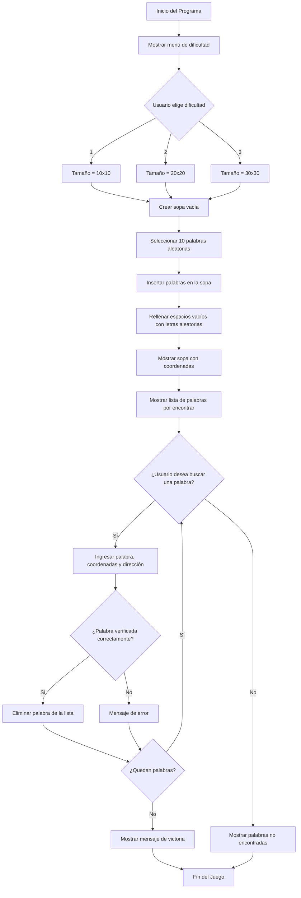

# Sintax-Slayer-Sopa-de-letras ⚔️

### Programacion de computadores

### Universidad Nacional de Colombia

### grupo 7

### Integrantes: 
- Cristian Amezquita
- Sebastian Vega
- Nicolas Valle

## Objetivo: 📌
Desarrollar una aplicación en Python que genere y permita jugar una sopa de letras de tamaño mínimo 10x10 y máximo 30x30, utilizando palabras clave relacionadas con la carrera de Ingeniería Civil, aplicando los conocimientos adquiridos durante el curso de programación.

## Objetivos especificos 📎
- Implementar estructuras de datos adecuadas (listas, matrices) para representar el tablero de la sopa de letras y gestionar el contenido de forma dinámica.

- Aplicar algoritmos de inserción y búsqueda de palabras en distintas direcciones (horizontal, vertical y diagonal), asegurando que estas no se sobrepongan incorrectamente ni excedan los límites de la matriz.

- Automatizar el proceso de generación del tablero, incluyendo la inserción de letras aleatorias en los espacios vacíos para camuflar las palabras ocultas.

- Diseñar una interfaz simple en consola que permita al usuario interactuar con el juego, ingresar palabras, recibir retroalimentación y visualizar el tablero actualizado.

- Integrar un conjunto de palabras relacionadas con Ingeniería Civil, tales como: cimentación, hormigón, estructura, acero, plano, geotecnia, topografía, entre otras, promoviendo así la familiarización con el vocabulario técnico de la profesión.

- Fomentar la reutilización del código mediante el uso de funciones y/o módulos, favoreciendo el desarrollo estructurado, legible y mantenible.

- Incorporar elementos básicos de validación y control de errores, como verificar la validez de palabras ingresadas o el rango del tablero.


## Diagrama 📋


# Explicación Codigo🔥
## 1️⃣ Importar librerías

```python
import random
```
Se importa el módulo random, que permite realizar elecciones aleatorias. Lo usaremos para:
- Escoger letras aleatorias para rellenar la sopa.
- Escoger posiciones aleatorias donde insertar las palabras.
- Escoger direcciones aleatorias (horizontal, vertical o diagonal).  
  
  
  
## 2️⃣ Lista de palabras
```python
palabras_ingenieria = [
    "PUENTE", "VIGA", "CIMENTACION", "CONCRETO", "ASFALTO",
    "TOPOGRAFIA", "DRENAJE", "SUELO", "ESTRUCTURA", "HORMIGON",
    "PLANOS", "MECANICA", "TRABAJO", "EDIFICIO", "LADRILLO", "COLUMNA"
]
```
Una lista de palabras clave relacionadas con ingeniería civil. Estas son las palabras que se ocultarán dentro de la sopa.  


## 3️⃣ Crear la sopa vacía
```python
def crear_sopa_vacia(tamaño):
    return [[' ' for _ in range(tamaño)] for _ in range(tamaño)]
```
Esta función crea una matriz cuadrada de espacios vacíos (' '), del tamaño que el usuario elija: 10x10, 20x20 o 30x30.  


## 4️⃣ Rellenar espacios vacíos con letras aleatorias
```python
def rellenar_sopa(sopa, tamaño):
    letras = 'ABCDEFGHIJKLMNOPQRSTUVWXYZÑ'
    for fila in range(tamaño):
        for columna in range(tamaño):
            if sopa[fila][columna] == ' ':
                sopa[fila][columna] = random.choice(letras)
```
Llena las casillas vacías (espacios ' ') con letras aleatorias del abecedario (incluye la Ñ). Así completa la sopa para que no queden huecos.
- Recorre toda la sopa.
- Si encuentra un espacio en blanco, lo reemplaza por una letra aleatoria.  

  

## 5️⃣ Verificaciones para insertar palabras
```python
def puede_insertar_horizontal(palabra, sopa, fila, columna):
    for i in range(len(palabra)):
        if sopa[fila][columna + i] != ' ':
            return False
    return True
```
Revisa si hay suficiente espacio horizontalmente desde una posición.
```python
def puede_insertar_vertical(palabra, sopa, fila, columna):
    for i in range(len(palabra)):
        if sopa[fila + i][columna] != ' ':
            return False
    return True
```
Revisa si hay espacio verticalmente desde una posición.
```python
def puede_insertar_diagonal(palabra, sopa, fila, columna):
    for i in range(len(palabra)):
        if sopa[fila + i][columna + i] != ' ':
            return False
    return True
```
Revisa si hay espacio diagonalmente desde una posición.
-Estas funciones garantizan que no se sobreescriban letras ya puestas.  


## 6️⃣ Insertar palabras en la sopa
```python
def insertar_horizontal(palabra, sopa, tamaño, posiciones):
    if len(palabra) > tamaño:
        return False
    for _ in range(50):
        fila = random.randint(0, tamaño - 1)
        columna = random.randint(0, tamaño - len(palabra))
        if puede_insertar_horizontal(palabra, sopa, fila, columna):
            for i in range(len(palabra)):
                sopa[fila][columna + i] = palabra[i]
                posiciones.append((fila, columna + i))
            return True
    return False
```
Intenta insertar una palabra horizontalmente. Guarda las coordenadas de cada letra en posiciones.
```python
def insertar_vertical(palabra, sopa, tamaño, posiciones):
    if len(palabra) > tamaño:
        return False
    for _ in range(50):
        fila = random.randint(0, tamaño - len(palabra))
        columna = random.randint(0, tamaño - 1)
        if puede_insertar_vertical(palabra, sopa, fila, columna):
            for i in range(len(palabra)):
                sopa[fila + i][columna] = palabra[i]
                posiciones.append((fila + i, columna))
            return True
    return False
```
Inserta palabras en dirección vertical.
```python
def insertar_diagonal(palabra, sopa, tamaño, posiciones):
    if len(palabra) > tamaño:
        return False
    for _ in range(50):
        fila = random.randint(0, tamaño - len(palabra))
        columna = random.randint(0, tamaño - len(palabra))
        if puede_insertar_diagonal(palabra, sopa, fila, columna):
            for i in range(len(palabra)):
                sopa[fila + i][columna + i] = palabra[i]
                posiciones.append((fila + i, columna + i))
            return True
    return False
```
- Inserta palabras en dirección diagonal.
- Se intenta hasta 50 veces encontrar una posición válida para cada palabra. Si no se puede, se descarta.  


## 7️⃣ Insertar varias palabras en la sopa
```python
def insertar_palabras(sopa, tamaño, palabras):
    ubicaciones = {}
    for palabra in palabras:
        palabra = palabra.upper()
        posiciones = []
        direccion = random.choice(['H', 'V', 'D'])
        if direccion == 'H':
            colocada = insertar_horizontal(palabra, sopa, tamaño, posiciones)
        elif direccion == 'V':
            colocada = insertar_vertical(palabra, sopa, tamaño, posiciones)
        else:
            colocada = insertar_diagonal(palabra, sopa, tamaño, posiciones)
        if colocada:
            ubicaciones[palabra] = posiciones
        else:
            print(f"No se pudo insertar la palabra: {palabra}")
    return ubicaciones
```
- Selecciona aleatoriamente la dirección de cada palabra (H, V, D), y trata de insertarla. Si se logra, se guarda su ubicación. Si no, se avisa con un print.  


## 8️⃣ Verificar si el usuario encontró la palabra
```python
def verificar_palabra(sopa, palabra, fila, columna, direccion):
    palabra = palabra.upper()  # Asegura que todo esté en mayúsculas
    try:
        if direccion == 'H':
            letras = ''.join(sopa[fila][columna + i] for i in range(len(palabra)))
        elif direccion == 'V':
            letras = ''.join(sopa[fila + i][columna] for i in range(len(palabra)))
        elif direccion == 'D':
            letras = ''.join(sopa[fila + i][columna + i] for i in range(len(palabra)))
        else:
            return False
        return letras == palabra
    except IndexError:
        return False:
```

- Toma las coordenadas ingresadas por el jugador y verifica si realmente desde esa posición y en esa dirección está la palabra que indicó.
- Usa try/except para manejar errores de índice si el usuario se sale de los límites de la matriz.  


  
## 9️⃣ Mostrar la sopa con coordenadas
```python
def mostrar_sopa(sopa, tamaño):
    print("\nSopa de Letras:\n")
    print("   " + " ".join([f"{col:>2}" for col in range(tamaño)]))  # Encabezado columnas
    for i, fila in enumerate(sopa):
        print(f"{i:>2} " + " ".join(f"{letra:>2}" for letra in fila))  # Filas con índice
```
Imprime la sopa en consola de forma ordenada:
- Agrega un encabezado con los números de columna.
- Enumera las filas.  

## 🔟 Lógica del juego principal
```python
def jugar_sopa_letras():
    print("Sopa de Letras: Sintas Slayer")
    print("Seleccione la dificultad:")
    print("1. Fácil (10x10)")
    print("2. Media (20x20)")
    print("3. Difícil (30x30)")

    while True:
        dificultad = input("Ingrese una opción (1/2/3): ").strip()
        if dificultad == '1':
            tamaño = 10
            break
        elif dificultad == '2':
            tamaño = 20
            break
        elif dificultad == '3':
            tamaño = 30
            break
        else:
            print("Opción inválida. Intente de nuevo.")

    sopa = crear_sopa_vacia(tamaño)
    cantidad_palabras = min(10, len(palabras_ingenieria))
    palabras_seleccionadas = random.sample(palabras_ingenieria, cantidad_palabras)
    ubicaciones = insertar_palabras(sopa, tamaño, palabras_seleccionadas)
    rellenar_sopa(sopa, tamaño)

    mostrar_sopa(sopa, tamaño)

    palabras_restantes = palabras_seleccionadas.copy()
    print("\nPalabras por encontrar:")
    print(palabras_restantes)

    while palabras_restantes:
        respuesta = input("\n¿Deseas intentar encontrar una palabra? (S/N): ").strip().upper()
        if respuesta != 'S':
            break

        palabra = input("Palabra: ").strip().upper()
        if palabra not in palabras_restantes:
            print("Palabra inválida o ya encontrada.")
            continue

        try:
            fila = int(input("Fila inicial (número): "))
            columna = int(input("Columna inicial (número): "))
            direccion = input("Dirección (H = horizontal, V = vertical, D = diagonal): ").strip().upper()

            if verificar_palabra(sopa, palabra, fila, columna, direccion):
                print(f" Correcto. Encontraste la palabra '{palabra}'.")
                palabras_restantes.remove(palabra)
            else:
                print(" Incorrecto. Intenta otra vez.")
        except:
            print(" Error en los datos ingresados. Intenta de nuevo.")

    if not palabras_restantes:
        print("\n Felicidades. Has encontrado todas las palabras.")
    else:
        print("\n Juego terminado. Palabras no encontradas:")
        print(palabras_restantes)
```
- Contiene toda la interacción con el usuario.  


# Código completo 💠

```python
import random

# Lista de palabras relacionadas con ingeniería civil
palabras_ingenieria = [
    "PUENTE", "VIGA", "CIMENTACION", "CONCRETO", "ASFALTO",
    "TOPOGRAFIA", "DRENAJE", "SUELO", "ESTRUCTURA", "HORMIGON",
    "PLANOS", "MECANICA", "TRABAJO", "EDIFICIO", "LADRILLO", "COLUMNA"
]

# Función para crear una sopa vacía de tamaño n x n
def crear_sopa_vacia(tamaño):
    return [[' ' for _ in range(tamaño)] for _ in range(tamaño)]

# Rellenar los espacios vacíos de la sopa con letras aleatorias
def rellenar_sopa(sopa, tamaño):
    letras = 'ABCDEFGHIJKLMNOPQRSTUVWXYZÑ'
    for fila in range(tamaño):
        for columna in range(tamaño):
            if sopa[fila][columna] == ' ':
                sopa[fila][columna] = random.choice(letras)

# Verificaciones de inserción para cada dirección
def puede_insertar_horizontal(palabra, sopa, fila, columna):
    for i in range(len(palabra)):
        if sopa[fila][columna + i] != ' ':
            return False
    return True

def puede_insertar_vertical(palabra, sopa, fila, columna):
    for i in range(len(palabra)):
        if sopa[fila + i][columna] != ' ':
            return False
    return True

def puede_insertar_diagonal(palabra, sopa, fila, columna):
    for i in range(len(palabra)):
        if sopa[fila + i][columna + i] != ' ':
            return False
    return True

# Funciones para insertar palabras en distintas direcciones
def insertar_horizontal(palabra, sopa, tamaño, posiciones):
    if len(palabra) > tamaño:
        return False
    for _ in range(50):
        fila = random.randint(0, tamaño - 1)
        columna = random.randint(0, tamaño - len(palabra))
        if puede_insertar_horizontal(palabra, sopa, fila, columna):
            for i in range(len(palabra)):
                sopa[fila][columna + i] = palabra[i]
                posiciones.append((fila, columna + i))
            return True
    return False

def insertar_vertical(palabra, sopa, tamaño, posiciones):
    if len(palabra) > tamaño:
        return False
    for _ in range(50):
        fila = random.randint(0, tamaño - len(palabra))
        columna = random.randint(0, tamaño - 1)
        if puede_insertar_vertical(palabra, sopa, fila, columna):
            for i in range(len(palabra)):
                sopa[fila + i][columna] = palabra[i]
                posiciones.append((fila + i, columna))
            return True
    return False

def insertar_diagonal(palabra, sopa, tamaño, posiciones):
    if len(palabra) > tamaño:
        return False
    for _ in range(50):
        fila = random.randint(0, tamaño - len(palabra))
        columna = random.randint(0, tamaño - len(palabra))
        if puede_insertar_diagonal(palabra, sopa, fila, columna):
            for i in range(len(palabra)):
                sopa[fila + i][columna + i] = palabra[i]
                posiciones.append((fila + i, columna + i))
            return True
    return False

# Inserta todas las palabras seleccionadas
def insertar_palabras(sopa, tamaño, palabras):
    ubicaciones = {}
    for palabra in palabras:
        palabra = palabra.upper()
        posiciones = []
        direccion = random.choice(['H', 'V', 'D'])
        if direccion == 'H':
            colocada = insertar_horizontal(palabra, sopa, tamaño, posiciones)
        elif direccion == 'V':
            colocada = insertar_vertical(palabra, sopa, tamaño, posiciones)
        else:
            colocada = insertar_diagonal(palabra, sopa, tamaño, posiciones)
        if colocada:
            ubicaciones[palabra] = posiciones
        else:
            print(f"No se pudo insertar la palabra: {palabra}")
    return ubicaciones

# Verifica si una palabra está correctamente ubicada según la dirección
def verificar_palabra(sopa, palabra, fila, columna, direccion):
    palabra = palabra.upper()
    try:
        if direccion == 'H':
            letras = ''.join(sopa[fila][columna + i] for i in range(len(palabra)))
        elif direccion == 'V':
            letras = ''.join(sopa[fila + i][columna] for i in range(len(palabra)))
        elif direccion == 'D':
            letras = ''.join(sopa[fila + i][columna + i] for i in range(len(palabra)))
        else:
            return False
        return letras == palabra
    except IndexError:
        return False

# Imprime la sopa con encabezado de coordenadas
def mostrar_sopa(sopa, tamaño):
    print("\nSopa de Letras:\n")
    print("   " + " ".join([f"{col:>2}" for col in range(tamaño)]))  # Encabezado columnas
    for i, fila in enumerate(sopa):
        print(f"{i:>2} " + " ".join(f"{letra:>2}" for letra in fila))  # Filas con índice

# Lógica principal del juego
def jugar_sopa_letras():
    print("Sopa de Letras: Sintas Slayer")
    print("Seleccione la dificultad:")
    print("1. Fácil (10x10)")
    print("2. Media (20x20)")
    print("3. Difícil (30x30)")

    while True:
        dificultad = input("Ingrese una opción (1/2/3): ").strip()
        if dificultad == '1':
            tamaño = 10
            break
        elif dificultad == '2':
            tamaño = 20
            break
        elif dificultad == '3':
            tamaño = 30
            break
        else:
            print("Opción inválida. Intente de nuevo.")

    sopa = crear_sopa_vacia(tamaño)
    cantidad_palabras = min(10, len(palabras_ingenieria))
    palabras_seleccionadas = random.sample(palabras_ingenieria, cantidad_palabras)
    ubicaciones = insertar_palabras(sopa, tamaño, palabras_seleccionadas)
    rellenar_sopa(sopa, tamaño)

    mostrar_sopa(sopa, tamaño)

    palabras_restantes = palabras_seleccionadas.copy()
    print("\nPalabras por encontrar:")
    print(palabras_restantes)

    while palabras_restantes:
        respuesta = input("\n¿Deseas intentar encontrar una palabra? (S/N): ").strip().upper()
        if respuesta != 'S':
            break

        palabra = input("Palabra: ").strip().upper()
        if palabra not in palabras_restantes:
            print("Palabra inválida o ya encontrada.")
            continue

        try:
            fila = int(input("Fila inicial (número): "))
            columna = int(input("Columna inicial (número): "))
            direccion = input("Dirección (H = horizontal, V = vertical, D = diagonal): ").strip().upper()

            if verificar_palabra(sopa, palabra, fila, columna, direccion):
                print(f" Correcto. Encontraste la palabra '{palabra}'.")
                palabras_restantes.remove(palabra)
            else:
                print(" Incorrecto. Intenta otra vez.")
        except:
            print(" Error en los datos ingresados. Intenta de nuevo.")

    if not palabras_restantes:
        print("\n Felicidades. Has encontrado todas las palabras.")
    else:
        print("\n Juego terminado. Palabras no encontradas:")
        print(palabras_restantes)

# Ejecutar el juego
if __name__ == "__main__":
    jugar_sopa_letras()
```


