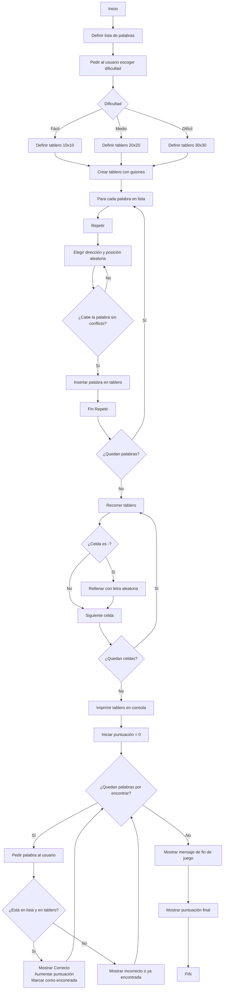

# Sintax-Slayer-Sopa-de-letras ⚔️

### Programacion de computadores

### Universidad Nacional de Colombia

### grupo 7

### Integrantes: 
- Cristian Amezquita
- Sebastian Vega
- Nicolas Valle

## Objetivo: 📌
Desarrollar una aplicación en Python que genere y permita jugar una sopa de letras de tamaño mínimo 10x10 y máximo 30x30, utilizando palabras clave relacionadas con la carrera de Ingeniería Civil, aplicando los conocimientos adquiridos durante el curso de programación.

## Objetivos especificos 📎
- Implementar estructuras de datos adecuadas (listas, matrices) para representar el tablero de la sopa de letras y gestionar el contenido de forma dinámica.

- Aplicar algoritmos de inserción y búsqueda de palabras en distintas direcciones (horizontal, vertical y diagonal), asegurando que estas no se sobrepongan incorrectamente ni excedan los límites de la matriz.

- Automatizar el proceso de generación del tablero, incluyendo la inserción de letras aleatorias en los espacios vacíos para camuflar las palabras ocultas.

- Diseñar una interfaz simple en consola que permita al usuario interactuar con el juego, ingresar palabras, recibir retroalimentación y visualizar el tablero actualizado.

- Integrar un conjunto de palabras relacionadas con Ingeniería Civil, tales como: cimentación, hormigón, estructura, acero, plano, geotecnia, topografía, entre otras, promoviendo así la familiarización con el vocabulario técnico de la profesión.

- Fomentar la reutilización del código mediante el uso de funciones y/o módulos, favoreciendo el desarrollo estructurado, legible y mantenible.

- Incorporar elementos básicos de validación y control de errores, como verificar la validez de palabras ingresadas o el rango del tablero.


## Diagrama


# Explicación Codigo
## 1️⃣ Importar librerías

```python
import random
```
Se importa el módulo random, que permite realizar elecciones aleatorias. Lo usaremos para:
- Escoger letras aleatorias para rellenar la sopa.
- Escoger posiciones aleatorias donde insertar las palabras.
- Escoger direcciones aleatorias (horizontal, vertical o diagonal).


## 2️⃣ Lista de palabras
```python
palabras_ingenieria = [
    "PUENTE", "VIGA", "CIMENTACION", "CONCRETO", "ASFALTO",
    "TOPOGRAFIA", "DRENAJE", "SUELO", "ESTRUCTURA", "HORMIGON",
    "PLANOS", "MECANICA", "TRABAJO", "EDIFICIO", "LADRILLO", "COLUMNA"
]
```
Una lista de palabras clave relacionadas con ingeniería civil. Estas son las palabras que se ocultarán dentro de la sopa.


## 3️⃣ Crear la sopa vacía
```python
def crear_sopa_vacia(tamaño):
    return [[' ' for _ in range(tamaño)] for _ in range(tamaño)]
```
Esta función crea una matriz cuadrada de espacios vacíos (' '), del tamaño que el usuario elija: 10x10, 20x20 o 30x30.


## 4️⃣ Rellenar espacios vacíos con letras aleatorias
```python
def rellenar_sopa(sopa, tamaño):
    letras = 'ABCDEFGHIJKLMNOPQRSTUVWXYZÑ'
    for fila in range(tamaño):
        for columna in range(tamaño):
            if sopa[fila][columna] == ' ':
                sopa[fila][columna] = random.choice(letras)
```
Llena las casillas vacías (espacios ' ') con letras aleatorias del abecedario (incluye la Ñ). Así completa la sopa para que no queden huecos.
- Recorre toda la sopa.
- Si encuentra un espacio en blanco, lo reemplaza por una letra aleatoria.

  

## 5️⃣ Verificaciones para insertar palabras
```python
def puede_insertar_horizontal(palabra, sopa, fila, columna):
```
Revisa si hay suficiente espacio horizontalmente desde una posición.
```python
def puede_insertar_vertical(palabra, sopa, fila, columna):
```
Revisa si hay espacio verticalmente desde una posición.
```python
def puede_insertar_diagonal(palabra, sopa, fila, columna):
```
Revisa si hay espacio diagonalmente desde una posición.
-Estas funciones garantizan que no se sobreescriban letras ya puestas.


## 6️⃣ Insertar palabras en la sopa
```python
def insertar_horizontal(palabra, sopa, tamaño, posiciones):
```
Intenta insertar una palabra horizontalmente. Guarda las coordenadas de cada letra en posiciones.
```python
def insertar_vertical(palabra, sopa, tamaño, posiciones):
```
Inserta palabras en dirección vertical.
```python
def insertar_diagonal(palabra, sopa, tamaño, posiciones):
```
- Inserta palabras en dirección diagonal.
- Se intenta hasta 50 veces encontrar una posición válida para cada palabra. Si no se puede, se descarta.


## 7️⃣ Insertar varias palabras en la sopa
```python
def insertar_palabras(sopa, tamaño, palabras):
```
- Selecciona aleatoriamente la dirección de cada palabra (H, V, D), y trata de insertarla. Si se logra, se guarda su ubicación. Si no, se avisa con un print.


## 8️⃣ Verificar si el usuario encontró la palabra
```python
def verificar_palabra(sopa, palabra, fila, columna, direccion):
```

- Toma las coordenadas ingresadas por el jugador y verifica si realmente desde esa posición y en esa dirección está la palabra que indicó.
- Usa try/except para manejar errores de índice si el usuario se sale de los límites de la matriz.


  
## 9️⃣ Mostrar la sopa con coordenadas
```python
def mostrar_sopa(sopa, tamaño):
```
Imprime la sopa en consola de forma ordenada:
- Agrega un encabezado con los números de columna.
- Enumera las filas.

## 🔟 Lógica del juego principal
```python
def jugar_sopa_letras():
```
- Contiene toda la interacción con el usuario


