# Sintax-Slayer-Sopa-de-letras ⚔️

### Programacion de computadores

### Universidad Nacional de Colombia

### grupo 7

### Integrantes: 
- Cristian Amezquita
- Sebastian Vega
- Nicolas Valle

## Objetivo: 📌
Desarrollar una aplicación en Python que genere y permita jugar una sopa de letras de tamaño mínimo 10x10 y máximo 30x30, utilizando palabras clave relacionadas con la carrera de Ingeniería Civil, aplicando los conocimientos adquiridos durante el curso de programación.

## Objetivos especificos 📎
- Implementar estructuras de datos adecuadas (listas, matrices) para representar el tablero de la sopa de letras y gestionar el contenido de forma dinámica.

- Aplicar algoritmos de inserción y búsqueda de palabras en distintas direcciones (horizontal, vertical y diagonal), asegurando que estas no se sobrepongan incorrectamente ni excedan los límites de la matriz.

- Automatizar el proceso de generación del tablero, incluyendo la inserción de letras aleatorias en los espacios vacíos para camuflar las palabras ocultas.

- Diseñar una interfaz simple en consola que permita al usuario interactuar con el juego, ingresar palabras, recibir retroalimentación y visualizar el tablero actualizado.

- Integrar un conjunto de palabras relacionadas con Ingeniería Civil, tales como: cimentación, hormigón, estructura, acero, plano, geotecnia, topografía, entre otras, promoviendo así la familiarización con el vocabulario técnico de la profesión.

- Fomentar la reutilización del código mediante el uso de funciones y/o módulos, favoreciendo el desarrollo estructurado, legible y mantenible.

- Incorporar elementos básicos de validación y control de errores, como verificar la validez de palabras ingresadas o el rango del tablero.


## Diagrama

```mermaid
flowchart TD
    A[Inicio] --> B[Definir lista de palabras]
    B --> C[Pedir al usuario escoger dificultad]
    C --> D{Dificultad}
    D -->|Fácil| E[Definir tablero 10x10]
    D -->|Medio| F[Definir tablero 20x20]
    D -->|Difícil| G[Definir tablero 30x30]
    E --> H[Crear tablero con guiones]
    F --> H
    G --> H

    H --> I[Para cada palabra en lista]
    I --> J[Repetir]
    J --> K[Elegir dirección y posición aleatoria]
    K --> L{¿Cabe la palabra sin conflicto?}
    L -->|Sí| M[Insertar palabra en tablero]
    M --> N[Fin Repetir]
    L -->|No| K
    N --> O{¿Quedan palabras?}
    O -->|Sí| I
    O -->|No| P[Recorrer tablero]

    P --> Q{¿Celda es -?}
    Q -->|Sí| R[Rellenar con letra aleatoria]
    Q -->|No| S[Siguiente celda]
    R --> S
    S --> T{¿Quedan celdas?}
    T -->|Sí| P
    T -->|No| U[Imprimir tablero en consola]

    U --> V[Iniciar puntuación = 0]
    V --> W{¿Quedan palabras por encontrar?}
    W -->|Sí| X[Pedir palabra al usuario]
    X --> Y{¿Está en lista y en tablero?}
    Y -->|Sí| Z[Mostrar Correcto\nAumentar puntuación\nMarcar como encontrada]
    Y -->|No| AA[Mostrar Incorrecto o ya encontrada]
    Z --> W
    AA --> W

    W -->|No| AB[Mostrar mensaje de fin de juego]
    AB --> AC[Mostrar puntuación final]
    AC --> AD[FIN]

```


# Explicación Codigo
## 1️⃣ Importación de módulos

```python
import random
import pandas as pd
```
- random: permite hacer selecciones aleatorias (por ejemplo, letras o posiciones).
- pandas (pd): se usa para mostrar la sopa de letras como una tabla más ordenada con coordenadas.

## 2️⃣ Lista de palabras
```python
palabras_ingenieria = [
    "PUENTE", "VIGA", "CIMENTACION", "CONCRETO", "ASFALTO",
    "TOPOGRAFIA", "DRENAJE", "SUELO", "ESTRUCTURA", "HORMIGON",
    "PLANOS", "MECANICA", "TRABAJO", "EDIFICIO", "LADRILLO", "COLUMNA"
]
```
Aquí definimoss las palabras que van a esconderse en la sopa de letras, todas relacionadas con ingeniería civil.

## 3️⃣ Crear la sopa vacía
```python
def crear_sopa_vacia(tamaño):
    return [[' ' for _ in range(tamaño)] for _ in range(tamaño)]
```
Esta función crea una matriz cuadrada de espacios vacíos (' '), del tamaño que el usuario elija: 10x10, 20x20 o 30x30.

## 4️⃣ Rellenar los espacios vacíos
```python
def rellenar_sopa(sopa, tamaño):
    letras = 'ABCDEFGHIJKLMNOPQRSTUVWXYZÑ'
    for i in range(tamaño):
        for j in range(tamaño):
            if sopa[i][j] == ' ':
                sopa[i][j] = random.choice(letras)
```
- Recorre toda la sopa.
- Si encuentra un espacio en blanco, lo reemplaza por una letra aleatoria.

## 5️⃣ Inserción horizontal
### Verifica si se puede insertar:
  
```python
def puede_insertar_horizontal(palabra, sopa, fila, col):
    for i in range(len(palabra)):
        if sopa[fila][col + i] != ' ':
            return False
    return True
```
Verifica que la palabra no se cruce con otra ya escrita en la misma fila.

### Insertar palabra horizontal:
```python
def insertar_horizontal(palabra, sopa, tamaño, posiciones):
    if len(palabra) > tamaño:
        return False
    for _ in range(50):
        fila = random.randint(0, tamaño - 1)
        col = random.randint(0, tamaño - len(palabra))
        if puede_insertar_horizontal(palabra, sopa, fila, col):
            for i in range(len(palabra)):
                sopa[fila][col + i] = palabra[i]
                posiciones.append((fila, col + i))
            return True
    return False
```
- Intenta colocar la palabra hasta 50 veces en posiciones aleatorias.
- Si encuentra un lugar válido, la inserta y guarda sus coordenadas.

## 6️⃣ Inserción vertical
 ### Verifica
```python
def puede_insertar_vertical(palabra, sopa, fila, col):
    for i in range(len(palabra)):
        if sopa[fila + i][col] != ' ':
            return False
    return True
```
- Verifica si la palabra cabe en vertical sin chocar.
 ### Insertar:
 ```python
 def insertar_vertical(palabra, sopa, tamaño, posiciones):
    if len(palabra) > tamaño:
        return False
    for _ in range(50):
        fila = random.randint(0, tamaño - len(palabra))
        col = random.randint(0, tamaño - 1)
        if puede_insertar_vertical(palabra, sopa, fila, col):
            for i in range(len(palabra)):
                sopa[fila + i][col] = palabra[i]
                posiciones.append((fila + i, col))
            return True
    return False
```
- Lo mismo que la horizontal pero de arriba a abajo.

## 7️⃣ Inserción diagonal
 ### Verificar:
```python
def puede_insertar_diagonal(palabra, sopa, fila, col):
    for i in range(len(palabra)):
        if sopa[fila + i][col + i] != ' ':
            return False
    return True
```
### Insertar:
```python
def insertar_diagonal(palabra, sopa, tamaño, posiciones):
    if len(palabra) > tamaño:
        return False
    for _ in range(50):
        fila = random.randint(0, tamaño - len(palabra))
        col = random.randint(0, tamaño - len(palabra))
        if puede_insertar_diagonal(palabra, sopa, fila, col):
            for i in range(len(palabra)):
                sopa[fila + i][col + i] = palabra[i]
                posiciones.append((fila + i, col + i))
            return True
    return False
```
## 8️⃣ Insertar todas las palabras
```python
def insertar_palabras(sopa, tamaño, palabras):
    ubicaciones = {}
    for palabra in palabras:
        palabra = palabra.upper()
        posiciones = []
        direccion = random.choice(['H', 'V', 'D'])
        if direccion == 'H':
            colocada = insertar_horizontal(palabra, sopa, tamaño, posiciones)
        elif direccion == 'V':
            colocada = insertar_vertical(palabra, sopa, tamaño, posiciones)
        else:
            colocada = insertar_diagonal(palabra, sopa, tamaño, posiciones)

        if colocada:
            ubicaciones[palabra] = posiciones
        else:
            print(f"No se pudo insertar la palabra: {palabra}")
    return ubicaciones
```
- Recorre todas las palabras seleccionadas.
- Elige al azar si va horizontal, vertical o diagonal.
- Guarda sus posiciones si logra insertarla.

## 9️⃣ Verificar palabra del jugador
```python
def verificar_palabra(sopa, palabra, fila, col, direccion):
    palabra = palabra.upper()
    try:
        if direccion == 'H':
            letras = ''.join(sopa[fila][col + i] for i in range(len(palabra)))
        elif direccion == 'V':
            letras = ''.join(sopa[fila + i][col] for i in range(len(palabra)))
        elif direccion == 'D':
            letras = ''.join(sopa[fila + i][col + i] for i in range(len(palabra)))
        else:
            return False
        return letras == palabra
    except IndexError:
        return False
```
- El jugador da una coordenada inicial y una dirección.
- Se extraen las letras en esa dirección y se comparan con la palabra que dijo.
- Si son iguales: ¡palabra encontrada!

## 🔟 Juego principal
```python
def jugar_sopa_letras():
    print("Sopa de Letras: Ingeniería Civil")
```


